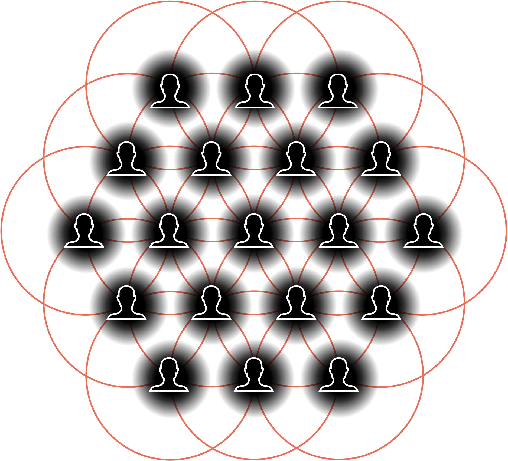

# Culture

Culture is a specific state of a collective, composed of individual human beings. Each individual can choose based on fear or love, leading to radically different experiences. When individuals choosing love come together, they form a culture characterized by freely sharing, giving, and gifting based on inspiration. Knowledge is shared freely, and the system orients towards richer co-creation. Culture is entirely distributed, lacking central control and authority outside the self. It evolves and adapts through resonance and distributed cognition, fundamentally seeking to serve what is true, good, and beautiful. The core protocol of culture is “give to be re-given.”